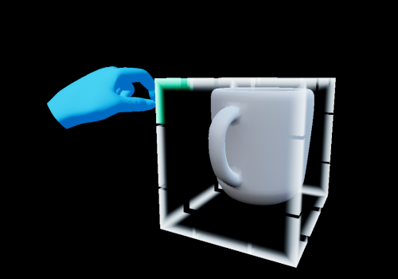

# BoundsControl

Bounds Control is a component that allows the user to change the position, rotation, and size of an actor, using _affordances_. Affordances are grabbable areas on corners, edges, and faces of the actor's bounding box.

To enable bounds control on an actor, add a UxtBoundsControl component. The component has a default configuration that can be tweaked to change the behavior and appearance as needed.

## Bounds Control Presets

These presets configure the overall set of affordances that are created and the way they affect the actor transform:

* _Default_: Uniform resizing with corners and rotation with edges.
* _Slate2D_: Only front corners and edges are shown, all resize.
* _AllResize_: Full set of affordances, all resizing.
* _AllTranslate_: Full set of affordances, all translating.
* _AllScale_: Full set of affordances, all scaling.
* _AllRotate_: Full set of affordances, all rotating.

## Affordance Configuration

There are four types of affordances:
* _Corner_: Each corner of the bounding box. Can move in all three dimensions.
* _Edge_: Middle of each edge of the bounding box. Movement is restricted to the plane perpendicular to the edge.
* _Face_: Center of each side of the bounding box. Movement is restricted to the axis along the face normal.
* _Center_: Center of the bounding box (not enabled by default).

Grabbing and moving an affordance can be configured for different effects on the actor transform:
* _Resize_: Move only one side of the bounding box.
* _Translate_: Move both sides of the bounding box in parallel.
* _Scale_: Scale the bounding box, moving both sides in opposite directions.
* _Rotate_: Rotate the bounding box about its center point.

## Affordance classes

To modify the appearance of the affordances the user can replace the default classes used by the bounds control. A different class is used for each of the four kinds of affordance (Corner, Edge, Face, Center). These classes are instantiated at runtime by the bounds control component to create grabbable actors.

When creating custom affordance blueprints a few conditions should be kept in mind:
* The affordance should by default be oriented in the _forward_, _right_, _up_ direction. Each affordance instance is rotated by the bounds control to match its placement on the bounding box.
* The affordance should have a UxtGrabTargetComponent to make it grabbable. The bounds control will use these components to react to user input.

  The affordance does not need to handle user input or grab events itself. It is automatically placed by the bounds control.

For customizing affordances it is recommended to use the _BoundsControl/BP_DefaultAffordanceBase_ blueprint as a base class or copy it.
