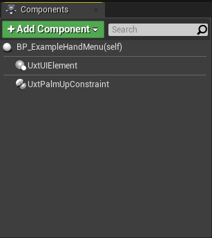
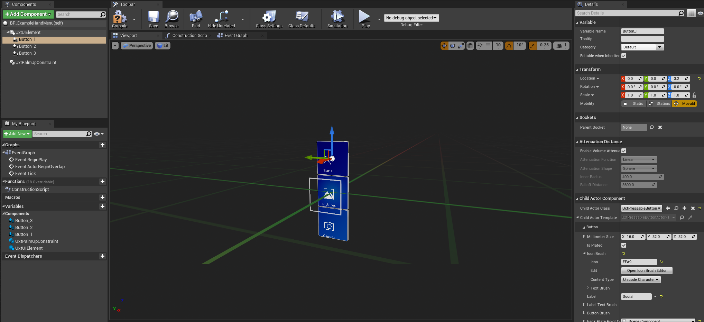
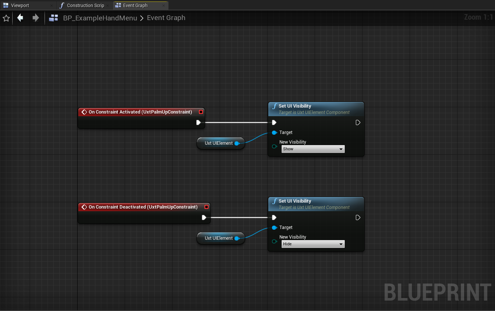
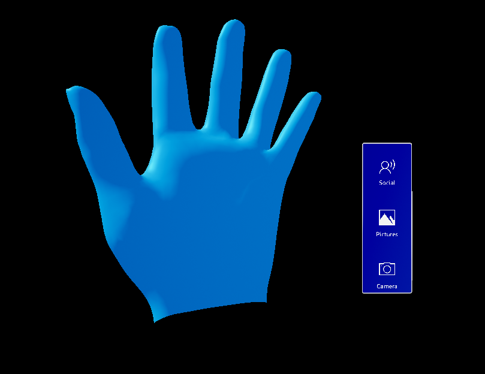

# Hand Menu
A hand menu is a user interface that appears when the user raises their palm and follows their hand as they move it.

There are some examples of various hand menus in `\Content\UXToolsGame\Examples\HandMenu\Blueprints`.

## Creating a hand menu
In this example we are going to create a basic three button hand menu, similar to `BP_SmallHandMenu` in the hand menu example scene.

1. The `UxtUIElementComponent` and the `UxtPalmUpConstraintComponent` handle the majority of the work for a simple hand menu.
    * Create a new blueprint actor, in this example we will call it `BP_ExampleHandMenu`.
    * Add a `UxtUIElementComponent` and set it as the root component for the actor.
    * Add a `UxtPalmUpConstraintComponent` and set _Require Flat Hand_ to true to prevent false activations.

    

2. Now that we have our foundation, we will add some buttons to the menu.
    * Add three `ChildActorComponent`s to the blueprint, and set their child actor class to `BP_ButtonHoloLens2`.
    * Move one button above and another below the center button. This will be a Z value of 3.2 and -3.2.
    * Configure the buttons using the [button options](PressableButton.md#visual-configuration) in the child actor template.

    

3. Next we want to give the buttons a seamless backplate.
    * Add a `UxtBackPlateComponent` and set its material to `MI_HoloLens2BackPlate`.
    * Set the back plate's scale to 9.6 on the X axis to make it three buttons tall.
    * Move the three button actors forward by 1.4 on the X axis to position them in front of the new backplate.
    * Un-check _Is Plated_ on the button actors to remove their default backplate.

    

4. Finally we want to show and hide the menu using the palm up constraint.
    * In the event graph, add the _On Constraint Activated_ and _On Constraint Deactivated_ events from the `UxtPalmUpConstraintComponent`
    * In _On Constraint Activated_, call _Set UI Visibility_ on the `UxtUIElementComponent` with a value of _Show_.
    * In _On Constraint Deactivated_, call _Set UI Visibility_ on the `UxtUIElementComponent` with a value of _Hide_.
    * You can configure how far the menu will sit from the hand with the _Goal Margin_ property on the `UxtPalmUpConstraintComponent`, for this example it is set to 3.6.

    

5. To test out the menu in editor, press the _Home_ key while moving a hand to put it in the flat palm pose.

    

## More information
* [UxtUIElementComponent](UIElements.md)
* [UxtPalmUpConstraintComponent](PalmUpConstraintComponent.md)
* [UxtPressableButtonComponent](PressableButton.md)
