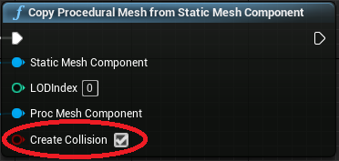
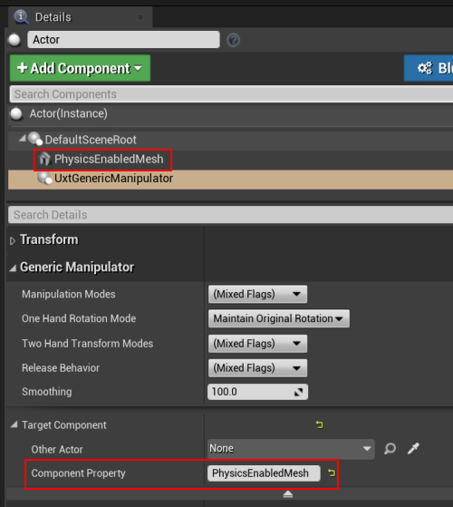

# Manipulator Components

Manipulator components allow an actor to be picked up by a user and then moved, rotated or scaled.

## Generic Manipulator

The _Generic Manipulator_ component is a general-purpose implementation of the _Manipulator Component Base_. It supports both one and two-handed manipulation with a number of configurable settings to change its behavior.

### One-handed manipulation

If one-handed manipulation is enabled the actor can be moved with just one hand. This mode supports movement and rotation, but not scaling of the actor.

The way hand rotation translates into actor rotation depends on the _One Hand Rotation Mode_:
* _Maintain Original Rotation_: Does not rotate object as it is being moved.
* _Rotate About Object Center_: Only works for articulated hands/controllers. Rotate object using rotation of the hand/controller, but about the object center point. Useful for inspecting at a distance.
* _Rotate About Grab Point_: Only works for articulated hands/controllers. Rotate object as if it was being held by hand/controller. Useful for inspection.
* _Maintain Rotation To User_: Maintains the object's original rotation for Y/Z axis to the user.
* _Gravity Aligned Maintain Rotation To User_: Maintains object's original rotation to user, but makes the object vertical. Useful for bounding boxes.
* _Face User_: Ensures object always faces the user. Useful for slates/panels.
* _Face Away From User_: Ensures object always faces away from user. Useful for slates/panels that are configured backwards.

### Two-handed manipulation

If two-handed manipulation is enabled the actor can be moved, rotated, and scaled by grabbing it with both hands. Each of these actions can be enabled or disabled separately as needed, e.g. an actor can have rotation and scaling enabled while movement is disabled.

Movement uses the center point between both hands, so each hand contributes half of the translation.

Rotation is based on imaginary axis between both hands. The actor will rotate with the change of this axis, while avoiding roll around it.

Scaling uses the change in distance between hands.

### Smoothing

The generic manipulator has a simple smoothing option to reduce jittering from noisy input. This becomes especially important with one-handed rotation, where hand tracking can be unreliable and the resulting transform amplifies jittering.

The smoothing method is based on a low-pass filter that gets applied to the source transform location and rotation. The resulting actor transform `T_final` is a exponentially weighted average of the current transform `T_current` and the raw target transform `T_target` based on the time step:

`T_final = Lerp( T_current, T_target, Exp(-Smoothing * DeltaSeconds) )`

## Notes

### Manipulating a Procedural Mesh

When using the _Generic Manipulator_ with a _Procedural Mesh_, you will need to:

* Disable "Use Complex as Simple Collision" on the _Procedural Mesh_.

* Set "Create Collision" when creating the _Procedural Mesh_.

This is due to UXTools only querying for simple collision volumes when detecting interaction targets, in order to ensure correct detection in all situations. You can read more about simple vs complex collisions [here](https://docs.unrealengine.com/en-US/Engine/Physics/SimpleVsComplex/index.html).

### Manipulating physics-enabled components

Sometimes you want to manipulate components that are physics-enabled, that is, components affected by gravity and collisions with other actors. If your physically simulated component (e.g. a _Static Mesh Component_ with _Simulate Physics_ enabled) is the root component of the actor, _Generic Manipulator_ will work out of the box. If the component is not the root, you'll have to set it as the target component of the manipulator:

This is necessary because:
* By default _Generic Manipulator_ modifies the transform of the actor's root component.
* Physics-enabled components [detach themselves][set-simulate-physics] from their attach parents automatically at simulation start.

[set-simulate-physics]: https://docs.unrealengine.com/en-US/API/Runtime/Engine/Components/UPrimitiveComponent/SetSimulatePhysics/index.html