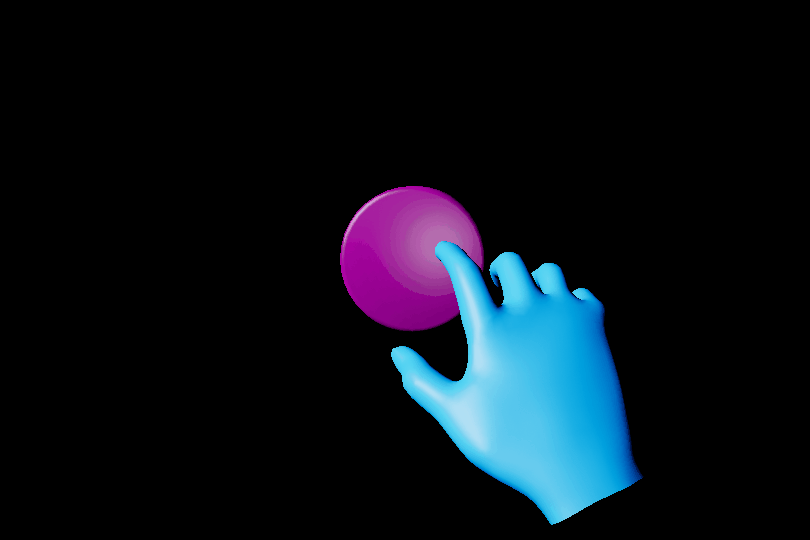
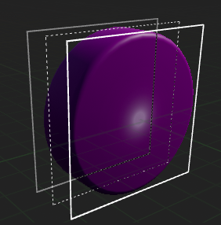
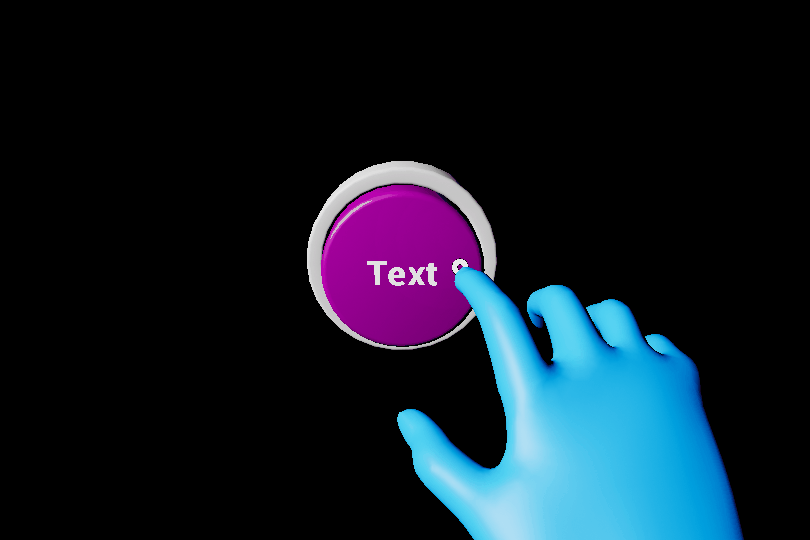
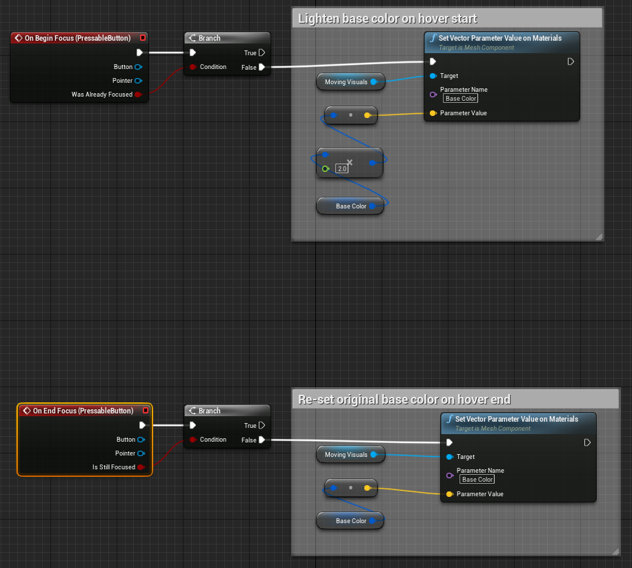
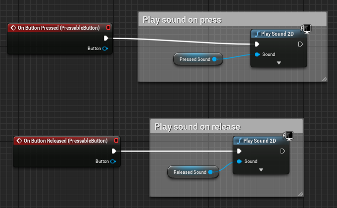

# Pressable button

A button gives the user a way to trigger an immediate action. It is one of the most foundational components in mixed reality.

## Creating a pressable button from scratch

The first step of creating a button from scratch is adding the [`UxtPressableButtonComponent`](xref:_u_uxt_pressable_button_component) to an actor blueprint. This is a low level component that drives button logic. This is followed by creating some moving visuals. Moving visuals are essential for pressable button interaction as they're visualizing pressed and released state.

Add a [`StaticMeshComponent`](https://docs.unrealengine.com/en-US/Engine/Components/StaticMesh/index.html) (or any [`SceneComponent`](https://docs.unrealengine.com/en-US/API/Runtime/Engine/Components/USceneComponent/index.html)) to the actor and set the visuals property of the `UxtPressableButtonComponent` to reference this new mesh. Also ensure that the local positive x-axis of this mesh component points in the direction the button is expected to be pushed. Any component children of this mesh will move along with it as the button is pushed.

It is important to note that the `UxtPressableButtonComponent` uses the component assigned to the visuals property to construct a `BoxComponent` that is used for poke and far interactions. The `UxtPressableButtonComponent` uses the the visuals property component bounds, and child bounds, to create this box collider.

If the button is configured correctly, the button should now react to presses during play. As well as this, the button planes visualizations will be visible in editor while `UxtPressableButtonComponent` is selected. These planes represent some of the properties of the button.

- The solid white plane is the front plane. if the finger crosses this plane from the front, the button will be **pushed**. The front plane aligns with the front face of the `BoxComponent` discussed earlier
- The dashed light grey plane is drawn so that it is PressedDistance away from the front plane. If the finger crosses this plane from the front, the button will be **pressed**. There is more information about this under [Pressed Fraction](#pressed-fraction).
- The solid dark grey plane is drawn so that it is MaxPushDistance away from the front plane. The moving visuals will not move beyond this plane. There is more information about this under [Max Push Distance](#max-push-distance).

A distinction is being made here between **push** and **press**. A button can be pushed without being pressed. A button will only fire OnButtonPressed once it has been pushed beyond the PressedDistance. If a button needs to respond to push, OnBeginPoke and OnEndPoke can be used.

Some buttons may also have static visuals. Static visuals can be created by adding another mesh component, making sure that it is not a child of the moving visuals.

Configuring the component hierarchy so that the buttons work should be simple. The only things that are essential are that the pressable button component is not a child of the moving visuals. Also ensure that only visuals that should move with press are children of the moving visuals. Here are some examples of configurations of the button hierarchy that will work:

Although this button is behaving correctly, it's not doing anything useful. The pressable button events can be used in a blueprint in order to respond to press/release. There are a few useful events that can be used:

- **OnBeginFocus**: This event is called when a pointer starts giving focus to the button.
- **OnUpdateFocus**: This event is called for every tick that the button has focus from a pointer. A button will hold focus while it is being pressed.
- **OnEndFocus**: This event is called when a pointer stops giving focus to the button.
- **OnBeginPoke**: This event is called when a near pointer starts pushing the button. See description above for the difference between a push and a press.
- **OnUpdatePoke**: This event is called tick that a pointer is pushing the button. See description above for the difference between a push and a press.
- **OnEndPoke**: This event is called when a near pointer stops pushing the button. See description above for the difference between a push and a press.
- **OnButtonPressed**: Called when the current push distance of the button exceeds the [pressed fraction](#pressed-fraction).
- **OnButtonReleased**: Called when the current push distance of the button subceeds the [released fraction](#pressed-fraction).
- **OnButtonEnabled**: Called when the button is enabled.
- **OnButtonDisabled**: Called when the button is disabled. This will not raise a release event if the button is disabled while pressed.

Here are some examples of these events in use in the SimpleButton blueprint sample provided with UXT:

## HoloLens 2 Button Blueprint

The HoloLens 2 button blueprint, named `BP_ButtonHoloLens2`, is a button blueprint that provides configurable HoloLens 2 Shell style visuals and behaviors. Please see the [graphics documentation](Graphics.md) for more information about the button's shaders and materials.

### Visual Configuration

To aid in the time it takes to configure buttons, a handful of blueprint variables are exposed which react to changes made during edit time and runtime. 

For example, changing the `Button Size` from (16, 32, 32) to (16, 64, 32) will automatically scale the button's front and back plates to create a wide button without effecting the button icon or label.

Updating the `Button Label` will automatically adjust the button's text render component. Changing the `Button Icon` to a new unicode code point will generate the appropriate unicode character to index into a font containing the icon (e.g. `Font_SegoeMDL2_Regular_42`). Note, the font atlas will need to be updated to support any new icons which are not already present within the font atlas. 

- To add a new icon, open the icon font, such as `Font_SegoeMDL2_Regular_42`. Under "Import Options" select the "Chars" property. Paste your icon's unicode character into the "Chars" property and save the font. Finally reimport the font uasset.

### Scripting Logic

All `UxtPressableButtonComponent` events are passed up to the parent `BP_ButtonHoloLens2` via the `BP_BaseButton` base class. So, any `BP_BaseButton` variables in other blueprints can easily bind to button events from the variable details panel without having to search for a child button component. In the below example "Hello" is printed when a `BP_BaseButton`, or any derived classes, are pressed:

### HoloLens 2 Button Variants

A handful of derived `BP_ButtonHoloLens2` blueprints exist to exhibit behavior not found on a typical pressable button. These variants include:

- `BP_ButtonHoloLens2Toggle`, displays an additional back plate based on the button's toggle state.

- `BP_ButtonHoloLens2ToggleCheck`, displays a check box icon based on the button's toggle state.

- `BP_ButtonHoloLens2ToggleSwitch`, displays a switch icon based on the button's toggle state.

## Public Properties

### Push Behavior
How the visuals should react when the button is pressed. Translate means the visuals move move along the local x-axis. Compress means the visuals will scale along the x-axis. Note, when compressed the visual's pivot should align with the back face of the compressible region. In other words, the plane visualized by the [max push distance](#max-push-distance).

### Max Push Distance
The maximum distance the button can move.

### Pressed Fraction
The fraction of the maximum push distance that an unpressed button needs to be pushed in order for the button pressed event to fire.

### Released Fraction
The fraction of the maximum push distance that a pressed button needs to be pushed in order for the button released event to fire.

### Recovery Speed
The speed at which the button visuals return to the their resting position when no longer being touched by near interaction or selected using far interaction.

### Front Face Collision Margin
The distance in front of the visuals front face to place the front of the button box collider.

### Visuals
A reference to the scene component that represents the moving part of the button. The extents of the button collider will also be constructed using this scene component and child bounds.

### Collision Profile
The collision profile used for the button collider, which is constructed using the moving visuals mesh component extents.